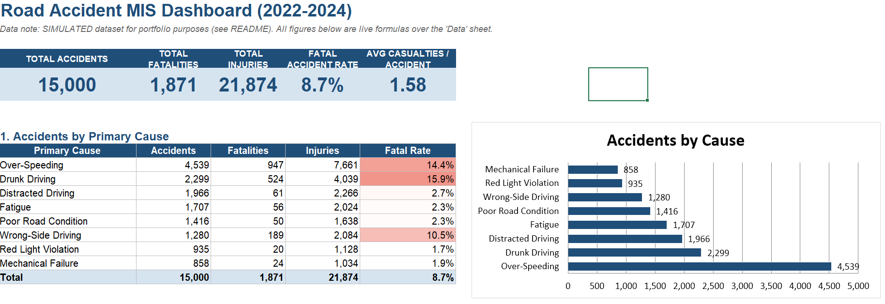
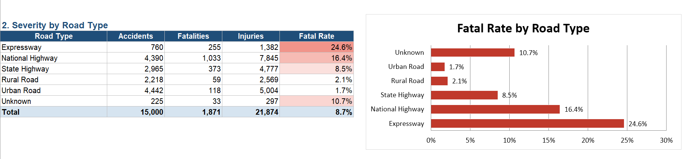
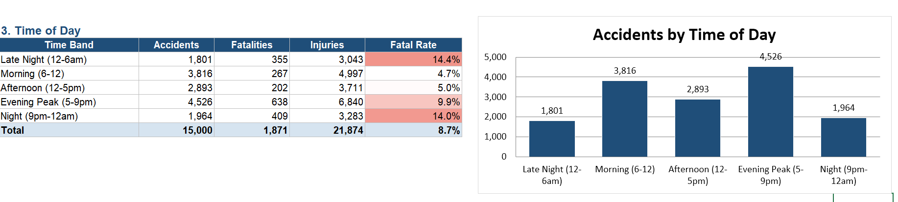
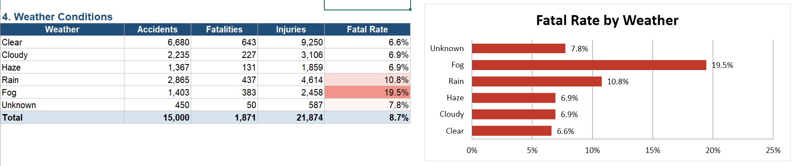
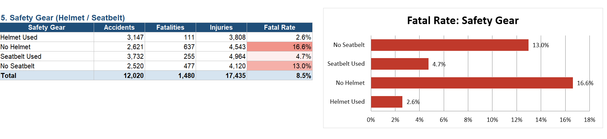
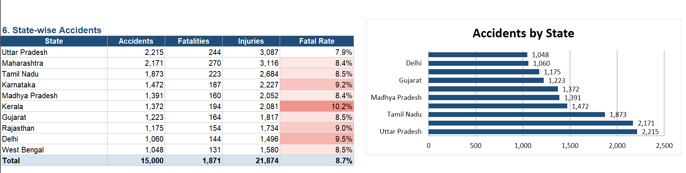
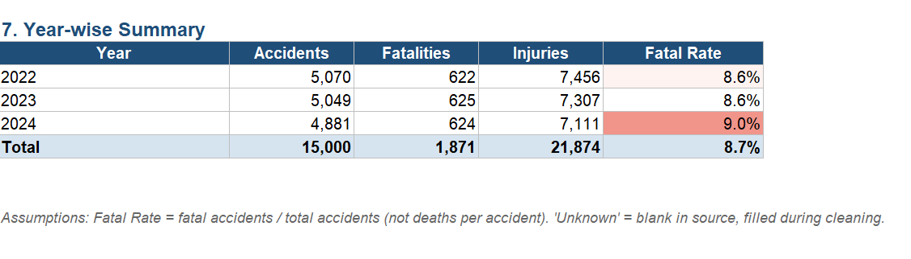

# Road Accident MIS Dashboard (Excel)

Formula-driven Excel MIS report analysing 15,000 road accident records (simulated data).

**Features**
- KPI cards: total accidents, fatalities, injuries, fatal accident rate
- 7 summary tables (cause, road type, time of day, weather, safety gear, state, year) using COUNTIFS, SUMIFS, SUMPRODUCT
- 6 charts and colour-scale conditional formatting
- Month-wise trend sheet with MoM % change
- Live formulas: paste new data into the Data sheet and everything refreshes

**Key insights**
- 30% of accidents occur between 5 and 9 PM
- Expressways have a 24.6% fatal rate vs 1.7% on urban roads
- No helmet: 16.6% fatal rate vs 2.6% with a helmet

## Dashboard Screenshots

**Tools:** MS Excel
